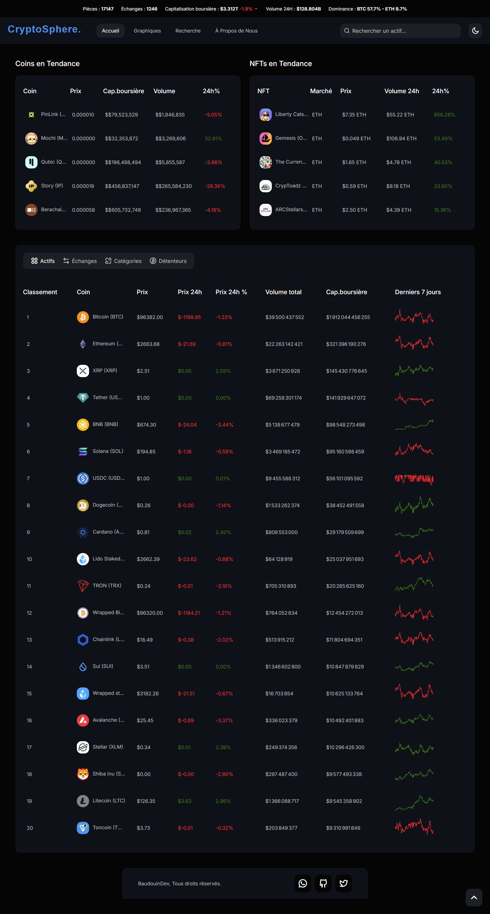

# CryptoSphere - BaudouinDev

Bienvenue sur CryptoSphere, une application complète de marketplace de cryptomonnaies développée par BaudouinDev. Cette application permet aux utilisateurs de consulter des informations détaillées sur les cryptomonnaies, de visualiser des graphiques de marché, de rechercher des actifs, et d'accéder à des informations sur les échanges et les NFTs.

## Fonctionnalités

- **Page d'accueil**: Affiche des informations globales sur les cryptomonnaies, y compris le nombre de pièces, les échanges, la capitalisation boursière, le volume 24H, et la dominance.
- **Page "À Propos"**: Fournit des informations sur l'histoire de l'entreprise et la mission de CryptoSphere.
- **Graphiques**: Affiche des widgets TradingView pour visualiser les données de marché des cryptomonnaies.
- **Recherche**: Permet aux utilisateurs de rechercher des actifs, des échanges et des NFTs.
- **Informations détaillées**: Affiche des informations détaillées sur une cryptomonnaie spécifique, y compris des statistiques, des graphiques, et des données historiques.

## Structure du projet

- **index.html**: Page d'accueil de l'application.
- **about.html**: Page "À Propos" avec des informations sur CryptoSphere.
- **charts.html**: Page des graphiques de marché des cryptomonnaies.
- **coin.html**: Page d'informations détaillées sur une cryptomonnaie.
- **search.html**: Page de recherche d'actifs, d'échanges et de NFTs.
- **assets/**: Dossier contenant les fichiers CSS et JavaScript.
  - **css/style.css**: Feuille de style principale de l'application.
  - **js/global.js**: Script global pour les fonctionnalités communes.
  - **js/chart.js**: Script pour la page des graphiques.
  - **js/coin.js**: Script pour la page des informations détaillées sur les cryptomonnaies.
  - **js/search.js**: Script pour la page de recherche.
  - **js/script.js**: Script principal gérant les onglets et l'affichage des données.

## Installation

1. Clonez le dépôt GitHub :
    ```bash
    git clone https://github.com/boris913/CryptoSphere-app.git
    cd CryptoSphere
    ```

2. Ouvrez le fichier `index.html` dans votre navigateur pour accéder à l'application.

## Utilisation

- **Navigation**: Utilisez la barre de navigation pour accéder aux différentes sections de l'application : Accueil, Graphiques, Recherche, À Propos.
- **Recherche**: Utilisez la barre de recherche pour trouver des informations sur des actifs, des échanges et des NFTs.
- **Consultation des détails**: Cliquez sur un actif dans les listes pour voir des informations détaillées et des graphiques.

## Screenshots

### Page d'accueil


### Graphiques


### Recherche


### Informations détaillées


## Contribution

Les contributions sont les bienvenues ! Si vous souhaitez contribuer à ce projet, veuillez soumettre une pull request avec une description claire des modifications apportées.

## Licence

Ce projet est sous licence MIT. Voir le fichier [LICENSE](LICENSE) pour plus de détails.

## Auteur

Développé par BaudouinDev. 